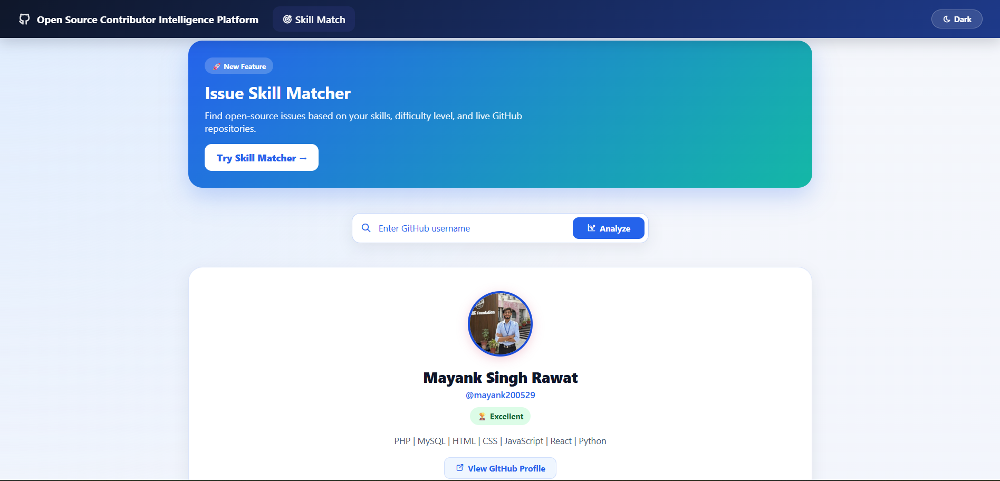
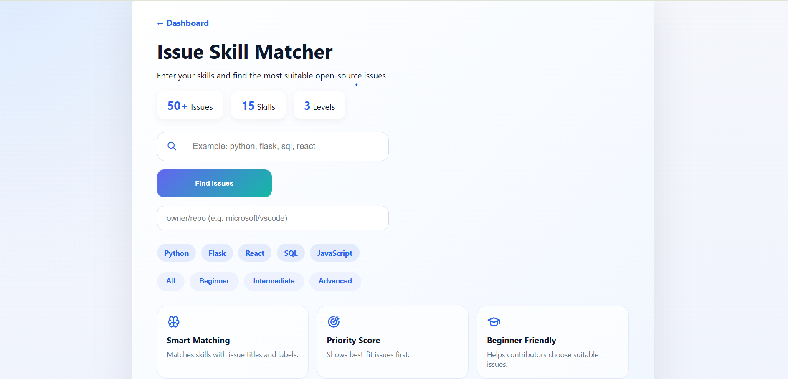
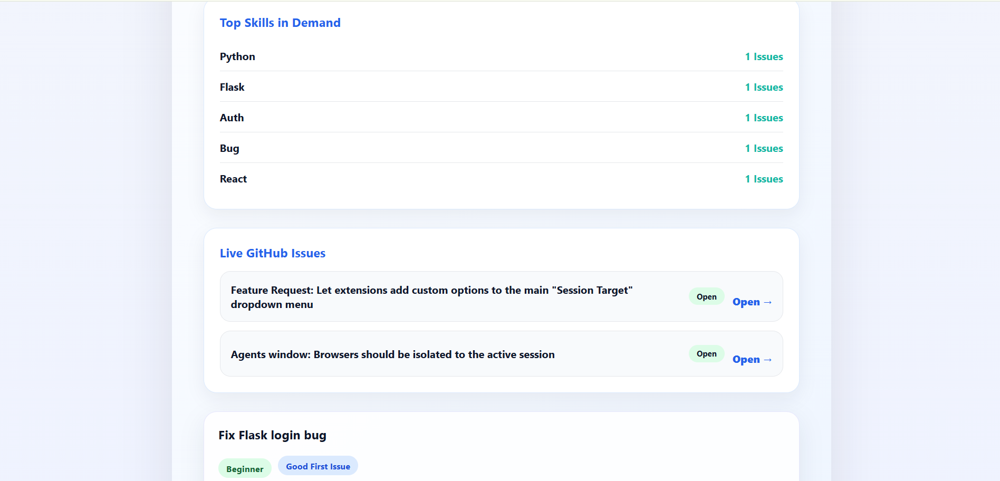

# 🚀 Open Source Contributor Intelligence Platform


## 🔗 Live Demo
https://open-source-contributor-intelligence.onrender.com/


An analytics and recommendation platform that analyzes GitHub contributor activity, repository health, contribution trends, and skill-based issue matching to help developers discover suitable open-source opportunities.

## ✨ Features

* 📊 Repository Analytics
* 🔄 Pull Request Analytics
* 💻 Commit Activity Tracking
* 🏆 Contributor Ranking System
* 📈 Repository Health Scoring
* 🔥 Contribution Heatmap Analytics
* 📉 Activity Trend Analysis
* 🤖 Activity Prediction Module
* 🎯 Skill-Based Issue Recommendation Engine
* 🏷 Difficulty-Based Issue Filtering
* 📚 Top Skills Demand Analytics
* 🌐 Live GitHub Issues Fetch (GitHub REST API)
* 📋 Interactive Power BI Dashboards


## 🚀 Web Platform Preview

### Dashboard Home


### Issue Skill Matcher


### Live GitHub Issues



## 📊 Dashboard Preview

### 1. Contributor Overview


### 2. Contributor Insights


### 3. Repository Health & Technology Insights


### 4. Contribution Activity Analytics


## 🛠 Tech Stack

### Backend

* Python
* Flask

### APIs

* GitHub REST API

### Data Processing

* Pandas
* NumPy

### Visualization

* Power BI
* HTML
* CSS
* JavaScript

## 📊 Dashboard Pages

### 1. Contributor Overview

* Total Commits
* Total Pull Requests
* Closed Pull Requests
* Activity Score
* Daily Contribution Activity
* Monthly Contribution Trends

### 2. Contributor Insights

* Contributor Ranking
* Productivity Score
* Contribution Metrics

### 3. Repository Health & Technology Insights

* Repository Health Analysis
* Technology Distribution
* Language Insights

### 4. Contribution Analytics

* Contribution Timeline
* Daily Contribution Volume
* Activity Trends

### 5. Activity Prediction

* Repository Activity Classification
* Commit Pattern Analysis

## 📂 Project Structure

```text
OpenSourceAnalytics
│
├── app
├── templates
├── static
├── data
├── ml
├── scripts
├── dashboard
├── Power BI Dashboards
├── Screenshots
├── README.md
└── requirements.txt
```

## ⚙️ Workflow

GitHub API  
⬇️  
Python Data Collection  
⬇️  
Pandas Processing  
⬇️  
CSV Datasets  
⬇️  
Power BI Dashboard  
⬇️  
Contributor Insights


## 📈 Platform Capabilities

* Analyze 20+ GitHub Repositories
* Process 250+ Contribution Events
* Generate 15+ Contributor & Repository KPIs
* Recommend Open-Source Issues Based on Skills
* Fetch Live GitHub Issues Using REST APIs
* Repository Health & Activity Scoring
* Interactive Analytics Dashboard

## 🚀 Future Enhancements

* Real-Time GitHub Synchronization
* Multi-Contributor Comparison
* AI-Powered Contributor Recommendations
* Contributor Retention Forecasting
* Automated Insight Generation
* Advanced Repository Health Metrics

## 👨‍💻 Author

**Mayank Singh Rawat**

B.Tech Information Technology
Jaipur Engineering College & Research Centre (JECRC)

GitHub: https://github.com/mayank200529
